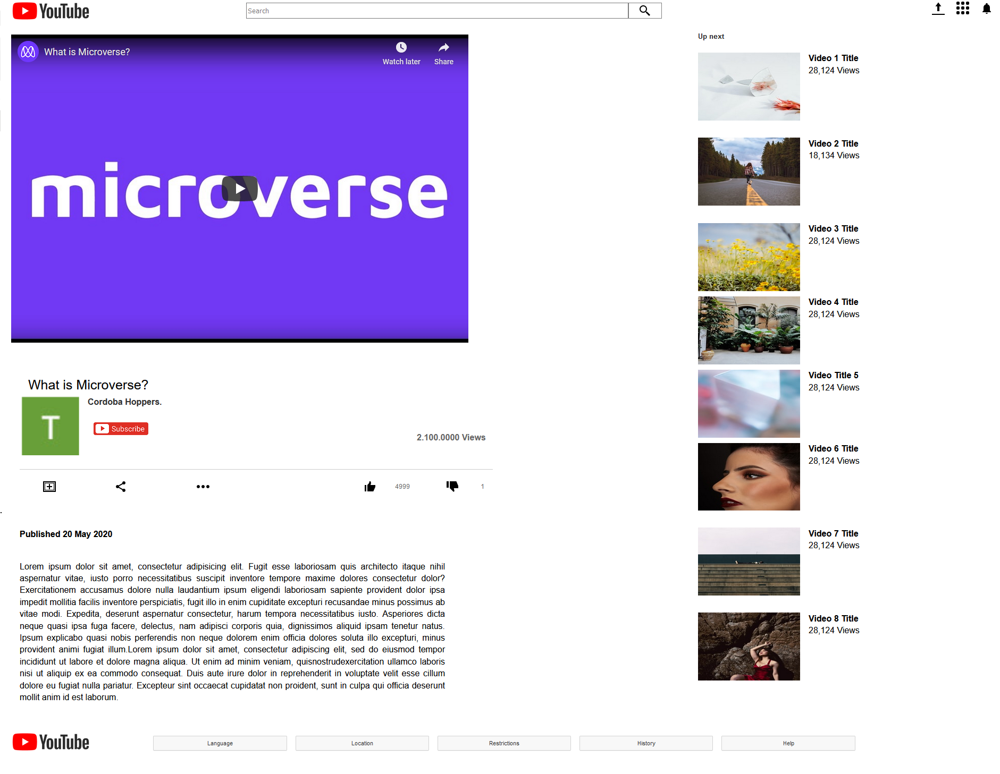

Microverse #1 Project ,  Main Course HTML #1, Embedding Images and Video

The focus of this project is to recreate with HTML and CSS the look of a standard YouTube Video Webpage.

    Preview

Built Using:

HTML
CSS

Main Features:

          Navigation bar
It has an embedded image that represents a logo.

The logo is aligned to the leftmost part of the navbar.

It has an input tag that represents a search bar.

The search bar is aligned to the middle of the navbar.

It has a button tag that represents the search button.

The search button is at the end (rightmost part) of the search bar.

It has at some embedded images on the rightmost part of the navbar that represent icons and/or an avatar.

          Video

It shows the video title.

It is displayed.

It shows the number of views.

It shows Avatar, Subscribe, Share, like and dislike buttons.

      Sidebar Recommended videos

It shows recommended related videos (as images, not links) with their respective titles

      Extras

Simulated Scrollable comment section.

Show More button (prop to load more comments)

  Live Link

<a href="https://rawcdn.githack.com/SigmaSam/Embeding-Images-and-Video-Ignacio-y-Samuel./36c88859e020a95e4311f6aaae6d876a01131f78/index.html" >Click Here</a>

Authors:

  Samuel Almao
Github: @SigmaSam
  Juan Ignacio Asis
Github: @KennyUTN
